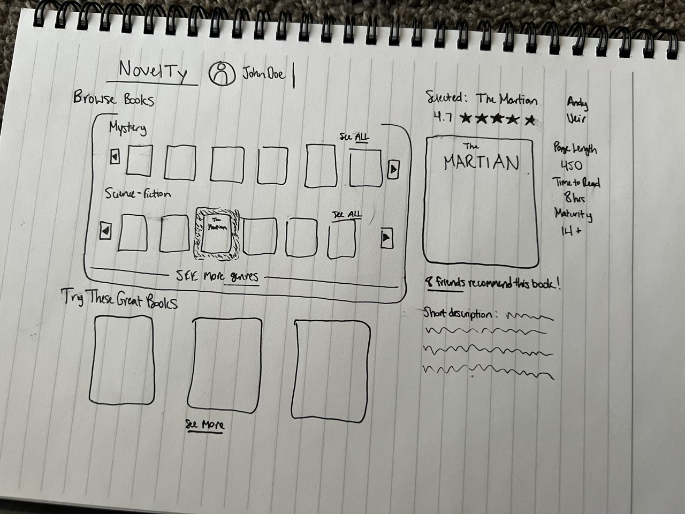
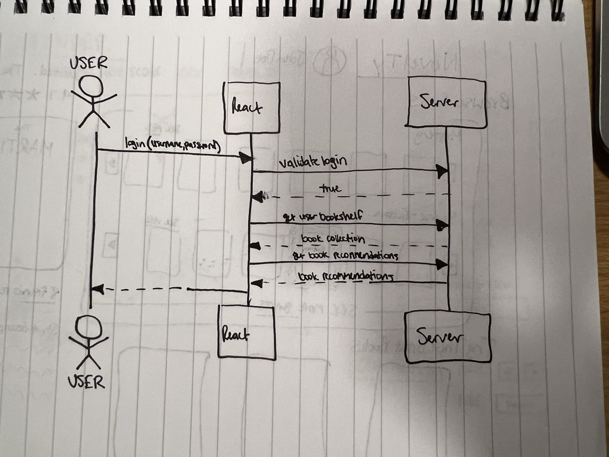

# NovelTy

[My Notes](notes.md)

Book reviewing website. Will require login so that it can track favorite books, save personal book ratings, and recommend new books based on what you and your friends enjoy. Users will be able browse a list of books and add their personal reviews of them. 

> [!NOTE]
>  This is a template for your startup application. You must modify this `README.md` file for each phase of your development. You only need to fill in the section for each deliverable when that deliverable is submitted in Canvas. Without completing the section for a deliverable, the TA will not know what to look for when grading your submission. Feel free to add additional information to each deliverable description, but make sure you at least have the list of rubric items and a description of what you did for each item.

## 🚀 Specification Deliverable

> [!NOTE]
>  Fill in this sections as the submission artifact for this deliverable. You can refer to this [example](https://github.com/webprogramming260/startup-example/blob/main/README.md) for inspiration.

For this deliverable I did the following. I checked the box `[x]` and added a description for things I completed.

- [x] Proper use of Markdown
- [x] A concise and compelling elevator pitch
- [x] Description of key features
- [x] Description of how you will use each technology
- [x] One or more rough sketches of your application. Images must be embedded in this file using Markdown image references.

### Elevator pitch

Are you tired of searching endlessly for a good book to read? Why not just use NovelTy? We will track the books you and your like so you will spend less time searching for a book, and more time reading a new favorite! And if you want to try something new, we have a full database of books to browse. NovelTy's purpose is to get you reading more of what you like!

### Design

Here is a sequence diagram showing the user logging into the home page, thus seeing his bookshelf and top recommendations:

### Key features

- User login for security
- Database of books with their page number, genre, and overall review
- Allows you to rate books and track which books you have read
- Recommends new books based on friends and your collection of favorite books

### Technologies

I am going to use the required technologies in the following ways.

- **HTML** - Used for structure. Will need separate pages. Will have a Registry Page, Home Page, Add Book Page, and a Browsing Page
- **CSS** - Used for decorating each page. Used to make a responsive layout for all viewports. Create grid for book selection.
- **React** - show homepage, buttons to add a book, browse library
- **Service** - Backend service with endpoints for: Registering logins, creating user profiles, validating logins, create new reviews, fetch bookshelf, get recommendations for users
- **DB/Login** - Stores users, books, reviews. Register and login users. Need to have authenticated login to leave a review.
- **WebSocket** - As new book is added to the shelf from a different login, it will be added automatically to the other user's shelf without refreshing.

## 🚀 AWS deliverable

For this deliverable I did the following. I checked the box `[x]` and added a description for things I completed.

- [X] **Server deployed and accessible with custom domain name** - [My server link](https://brycetaylor.link).

## 🚀 HTML deliverable

For this deliverable I did the following. I checked the box `[x]` and added a description for things I completed.

- [X] **HTML pages** - I have 5 separate pages that are used in the website. Home (index), AddBook, Register, Login, and Browse
- [X] **Proper HTML element usage** - I used the many input elements in the addBook.html, including the range, number, and text inputs. browse.html contains tables that have images inseerted as well. Link elements are placed in both the header and footer of each page.
- [X] **Links** - The header on top of each page allows you to navigate. Register takes you to login, and login will take you to the home page.
- [X] **Text** - I have multiple pieces of text throughout the website.
- [X] **3rd party API placeholder** - I will use a third party API image library to source the images for my book covers.
- [X] **Images** - The book covers in both the browse.html and index.html all use images.
- [X] **Login placeholder** - My login.html is the placeholder for this. It has user input that after entering sends you to the home page.
- [X] **DB data placeholder** - The 4 books are a placeholder for the database that will hold all of that information :)
- [X] **WebSocket placeholder** - The "loading books..." is a placeholder for when other users at new books to the database

## 🚀 CSS deliverable

For this deliverable I did the following. I checked the box `[x]` and added a description for things I completed.

- [X] **Header, footer, and main content body** - I did not complete this part of the deliverable.
- [X] **Navigation elements** - I did not complete this part of the deliverable.
- [X] **Responsive to window resizing** - I did not complete this part of the deliverable.
- [X] **Application elements** - I did not complete this part of the deliverable.
- [X] **Application text content** - I did not complete this part of the deliverable.
- [X] **Application images** - I did not complete this part of the deliverable.

## 🚀 React part 1: Routing deliverable

For this deliverable I did the following. I checked the box `[x]` and added a description for things I completed.

- [ ] **Bundled using Vite** - I did not complete this part of the deliverable.
- [ ] **Components** - I did not complete this part of the deliverable.
- [ ] **Router** - I did not complete this part of the deliverable.

## 🚀 React part 2: Reactivity deliverable

For this deliverable I did the following. I checked the box `[x]` and added a description for things I completed.

- [ ] **All functionality implemented or mocked out** - I did not complete this part of the deliverable.
- [ ] **Hooks** - I did not complete this part of the deliverable.

## 🚀 Service deliverable

For this deliverable I did the following. I checked the box `[x]` and added a description for things I completed.

- [ ] **Node.js/Express HTTP service** - I did not complete this part of the deliverable.
- [ ] **Static middleware for frontend** - I did not complete this part of the deliverable.
- [ ] **Calls to third party endpoints** - I did not complete this part of the deliverable.
- [ ] **Backend service endpoints** - I did not complete this part of the deliverable.
- [ ] **Frontend calls service endpoints** - I did not complete this part of the deliverable.
- [ ] **Supports registration, login, logout, and restricted endpoint** - I did not complete this part of the deliverable.

## 🚀 DB deliverable

For this deliverable I did the following. I checked the box `[x]` and added a description for things I completed.

- [ ] **Stores data in MongoDB** - I did not complete this part of the deliverable.
- [ ] **Stores credentials in MongoDB** - I did not complete this part of the deliverable.

## 🚀 WebSocket deliverable

For this deliverable I did the following. I checked the box `[x]` and added a description for things I completed.

- [ ] **Backend listens for WebSocket connection** - I did not complete this part of the deliverable.
- [ ] **Frontend makes WebSocket connection** - I did not complete this part of the deliverable.
- [ ] **Data sent over WebSocket connection** - I did not complete this part of the deliverable.
- [ ] **WebSocket data displayed** - I did not complete this part of the deliverable.
- [ ] **Application is fully functional** - I did not complete this part of the deliverable.
